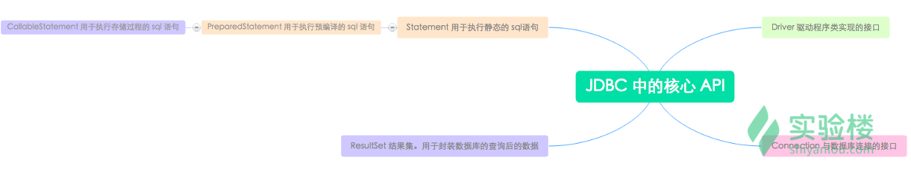

# JDBC知识点


### 一、数据库连接等初始步骤


#### 1. 注册JDBC驱动程序

```java
// 方法一、Class.forName():
// 动态加载一个类最常用的方法就是使用Java的Class.forName()方法，通过使用这个方法来将数据库的驱动类动态加载到内存中。
try{
  String dirver = "com.mysql.jdbc.Driver";
  Class.forName(driver);
}catch(ClassNotFoundException ex){
  System.out.println("Error: unable to load driver class!");
  System.exit(1);
}


// 方法二、DDriverManager.registerDriver():
Driver driver = new com.mysql.jdbc.Driver();
DriverManger.registerDriver(driver);
```


#### 2.指定数据库连接URL

```java
// 当加载了驱动程序，便可以使用DriverManger.getConnection()方法连接到数据库了。
// DriverManager.getConnection()有三个重载方法
getConnection(String url)
getConnection(String url, Properties prop)
getConnection(String url, String user, String password)
```

数据库的URL是指向数据库地址。以下列出了流行的JDBC驱动程序名和数据库的URL

| RDBMS  | JDBC 驱动程序的名称             | URL                                                 |
| ------ | ------------------------------- | --------------------------------------------------- |
| Mysql  | com.mysql.jdbc.Driver           | jdbc:mysql://hostname/ databaseName                 |
| Oracle | oracle.jdbc.driver.OracleDriver | jdbc:oracle:thin:@hostname:port Number:databaseName |
| DB2    | COM.ibm.db2.jdbc.net.DB2Driver  | jdbc:db2:hostname:port Number/databaseName          |
| Sybase | com.sybase.jdbc.SybDriver       | jdbc:sybase:Tds:hostname: port Number/databaseName  |


#### 3.创建连接对象

```java
// 方法一、使用数据库 URL 的用户名和密码
String URL = "jdbc:mysql://localhost:3306/db_name";
String USER = "username";
String PASS = "password"
Connection conn = DriverManager.getConnection(URL, USER, PASS);


// 方法二、使用数据库的 URL 和一个Properties 对象
import java.util.*;

String URL = "jdbc:mysql://localhost/EXAMPLE";
Properties pro = new Properties( );

//Properties对象，保存一组关键字-值对
pro.put( "user", "root" );
pro.put( "password", "" );

Connection conn = DriverManager.getConnection(URL, pro);
```


#### 4.关闭 JDBC 连接

```java
// conn 是数据库连接对象
conn.close(); 	// 释放内存
```


#### 5.创建Statement对象

```java
// conn 是数据库连接对象
Statement statement = conn.createStatement();
```


#### 6.执行sql

```java
statement.execute("create database db_name");
```


#### 7.总

```java
import java.sql.*;

public class CreateDatabase {
    public static void main(String[] args){
        Connection connection = null;
        try {
            //加载数据库驱动
            Class.forName("com.mysql.jdbc.Driver");
            //打开数据库连接 第一个参数为数据库地址  后面2个参数分别为数据库用户名和密码
            connection = DriverManager.getConnection("jdbc:mysql://localhost:3306/","root","");
            //创建Statement
            Statement statement = connection.createStatement();
            //执行sql
            statement.execute("create database EXAMPLE");
        } catch (ClassNotFoundException e) {
            e.printStackTrace();
        } catch (SQLException e) {
            e.printStackTrace();
        }finally {
            try {
                //关闭连接
                if (connection != null) {
                    connection.close();
                }
            } catch (SQLException e) {
                e.printStackTrace();
            }
        }
    }
}
```

```shell
// 以上代码 CreateDatabase.java 文件已经创建好的基础上，编译运行（需要带上 mysql-connector-java-5.1.45.jar):
// 在命令行中输入：

$ wget http://labfile.oss.aliyuncs.com/courses/1230/mysql-connector-java-5.1.47.jar
$ javac -cp mysql-connector-java-5.1.47.jar CreateDatabase.java
$ java -cp .:mysql-connector-java-5.1.47.jar CreateDatabase
```


### 二、数据库操作



通过使用 JDBC Statement, CallableStatement 和 PreparedStatement 接口定义的方法和属性，使可以使用 SQL 或 PL/SQL 命令和从数据库接收数据。它们还定义了许多方法，帮助消除 Java 和数据库之间数据类型的差异。

| 接口              | 应用场景                                                     |
| ----------------- | ------------------------------------------------------------ |
| Statement         | 当在运行时使用静态 SQL 语句时（Statement 接口不能接收参数）  |
| CallableStatement | 当要访问数据库中的存储过程时（CallableStatement 对象的接口还可以接收运行时输入参数） |
| PreparedStatement | 当计划多次使用 SQL 语句时（PreparedStatement 接口接收在运行时输入参数） |

#### 1.浅入Statement

| 方法                               | 说明                                                         |
| ---------------------------------- | ------------------------------------------------------------ |
| boolean execute(String SQL)        | 如果 ResultSet 对象可以被检索返回布尔值 true，否则返回 false。使用这个方法来执行 SQL DDL 语句，或当需要使用真正的动态 SQL |
| int executeUpdate(String SQL)      | 用于执行 INSERT、UPDATE 或 DELETE 语句以及 SQLDDL（数据定义语言）语句。返回值是一个整数，指示受影响的行数（即更新计数） |
| ResultSet executeQuery(String SQL) | 返回 ResultSet 对象。用于产生单个结果集的语句，例如 SELECT 语句 |

```java
// 大致用法
Statement stmt = null;
try {
   stmt = conn.createStatement( );
   . . .
}
catch (SQLException e) {
   . . .
}
finally {
   stmt.close();
}
```


#### 2.浅入PreparedStatement

PreparedStatement 接口扩展了 Statement 接口，有利于高效的执行多次使用的SQL语句。 Statement 为一条 SQL 语句生成执行计划。如果要执行两条 SQL 语句，会生成两个执行计划。一万个查询就生成一万个执行计划！ 

```mysql
select colume from table where colume=1;
select colume from table where colume=2;
```

PreparedStatement 用于使用绑定变量重用执行计划。

```mysql
select colume from table where colume=:x;
```

通过 set 不同数据，只需要生成一次执行计划，并且可以重用。

```java
PreparedStatement pstmt = null;
try {

/*
在JDBC中所有的参数都被代表？符号，这是已知的参数标记。在执行SQL语句之前，必须提供值的每一个参数。
*/
   String SQL = "Update Students SET age = ? WHERE id = ?";
   pstmt = conn.prepareStatement(SQL);
   . . .
}
/*

setXXX()方法将值绑定到参数，其中XXX表示希望绑定到输入参数值的 Java 数据类型。如果忘了提供值，将收到一个 SQLException。
*/
catch (SQLException e) {
   . . .
}
finally {
//同理，我们需要关闭 PreparedStatement 对象
   pstmt.close();
}
```

PreparedStatement实践

```java
import java.sql.*;

public class JdbcTest {
   // JDBC 驱动器的名称和数据库地址
   static final String JDBC_DRIVER = "com.mysql.jdbc.Driver";  
   static final String DB_URL = "jdbc:mysql://localhost/EXAMPLE";


   static final String USER = "root";
   static final String PASS = "";

   public static void main(String[] args) {
       Connection conn = null;
       PreparedStatement stmt = null;
       try{
           //注册 JDBC 驱动器
           Class.forName("com.mysql.jdbc.Driver");

           //打开连接
           System.out.println("Connecting to database...");
           conn = DriverManager.getConnection(DB_URL,USER,PASS);

           //执行查询
           System.out.println("Creating statement...");
           //这里我们要更改一个同学的年龄，参数待定
           String sql = "UPDATE Students set age=? WHERE id=?";
           stmt = conn.prepareStatement(sql);

           //将值绑定到参数，参数从左至右序号为1，2...
           stmt.setInt(1, 22);  // 绑定 age 的值(序号为1)
           stmt.setInt(2, 1); // 绑定 ID 的值

           // 更新 ID 为1的同学的年龄
           int rows = stmt.executeUpdate();
           System.out.println("被影响的行数 : " + rows );

           // 查询所有记录，并显示.
           sql = "SELECT id, name, age FROM Students";
           ResultSet rs = stmt.executeQuery(sql);

           //处理结果集
           while(rs.next()){
               //检索
               int id  = rs.getInt("id");
               int age = rs.getInt("age");
               String name = rs.getString("name");


               //显示
               System.out.print("ID: " + id);
               System.out.print(", Age: " + age);
               System.out.print(", Name: " + name);
               System.out.println();
           }
           //清理
           rs.close();
           stmt.close();
           conn.close();
       }catch(SQLException se){
           se.printStackTrace();
       }catch(Exception e){
           e.printStackTrace();
       }finally{
           try{
               if(stmt!=null)
                   stmt.close();
           }catch(SQLException se2){
           }
    try{
         if(conn!=null)
                 conn.close();
      }catch(SQLException se){
              se.printStackTrace();
          }
       }
           System.out.println("Goodbye!");
   }
}
```

编译运行：

```shell
$ wget http://labfile.oss.aliyuncs.com/courses/110/mysql-connector-java-5.1.47.jar   
$ javac -cp .:mysql-connector-java-5.1.47.jar JdbcTest.java     
$ java -cp .:mysql-connector-java-5.1.47.jar JdbcTest      
```


#### 3.浅入CallableStatement（未理解）

CallableStatement 对象为所有的 DBMS 提供了一种以标准形式调用存储过程的方法。存储过程储存在数据库中。对储存过程的调用是 CallableStatement 对象所含的内容。三种类型的参数有：IN，OUT 和 INOUT。PreparedStatement 对象只使用IN参数。 CallableStatement 对象可以使用所有三个

| 参数  | 描述                                                         |
| ----- | ------------------------------------------------------------ |
| IN    | 它的值是在创建 SQL 语句时未知的参数，将 IN 参数传给 CallableStatement 对象是通过 setXXX() 方法完成的 |
| OUT   | 其值由它返回的 SQL 语句提供的参数。从 OUT 参数的 getXXX() 方法检索值 |
| INOUT | 同时提供输入和输出值的参数，绑定的 setXXX() 方法的变量，并使用 getXXX() 方法检索值 |

在 JDBC 中调用存储过程的语法如下所示。注意，方括号表示其间的内容是可选项；方括号本身并不是语法的组成部份。

```java
{call 存储过程名[(?, ?, ...)]} 
```

返回结果参数的过程的语法为：

```java
{? = call 存储过程名[(?, ?, ...)]} 
```

不带参数的存储过程的语法类似：

```java
{call 存储过程名} 
```

CallableStatement 对象是用 Connection 方法 prepareCall 创建的。

```java
CallableStatement cstmt = null;
try {
   String SQL = "{call getEXAMPLEName (?, ?)}";
   cstmt = conn.prepareCall (SQL);
   . . .
}
catch (SQLException e) {
   . . .
}
finally {
   cstmt.close();
}
```

#### 4.浅入ResultSet

```java
// TODO
```


### 三、JDBC事务

```java
Connection conn = null;
conn = DriverManager.getConnection(URL);

//关闭自动提交（启动事务）
conn.setAutoCommit(false);
// TODO 删除订单主表
...
// TODO 为了保持数据的统一性，删除订单主表的同时还需要删除与订单主表相关联的订单详情表
...
// 两订单表的数据都删除成功的时候，提交事务，刚刚对数据库的操作生效
conn.commit();	
// 两订单表在删除的过程出现异常，回滚事务
conn.rollback();
```


jdbc.properties

```properties
driverClass=com.mysql.jdbc.Driver
url=jdbc:mysql://jdbc:mysql://192.168.31.58:3306/test
username=root
password=root
#dirverClass: com.mysql.jdbc.Driver
#url: jdbc:mysql://jdbc:mysql://192.168.31.58:3306/test
#username: root
#password: root
```

JDBCUtils.java

```java
package com.imooc.jdbc.utils;

import java.io.IOException;
import java.io.InputStream;
import java.sql.Connection;
import java.sql.DriverManager;
import java.sql.ResultSet;
import java.sql.SQLException;
import java.sql.Statement;
import java.util.Properties;

/**
 * JDBC的工具类
 * @author jt
 *
 */
public class JDBCUtils {
   private static final String driverClass;
   private static final String url;
   private static final String username;
   private static final String password;
   
   static{
      // 加载属性文件并解析：
      Properties props = new Properties();
      // 如何获得属性文件的输入流？
      // 通常情况下使用类的加载器的方式进行获取：
      InputStream is = JDBCUtils.class.getClassLoader().getResourceAsStream("jdbc.properties");
      try {
         props.load(is);
      } catch (IOException e) {
         e.printStackTrace();
      }
      
      driverClass = props.getProperty("driverClass");
      url = props.getProperty("url");
      username = props.getProperty("username");
      password = props.getProperty("password");
   }

   /**
    * 注册驱动的方法
    * @throws ClassNotFoundException 
    */
   public static void loadDriver() throws ClassNotFoundException{
      Class.forName(driverClass);
   }
   
   /**
    * 获得连接的方法:
    * @throws SQLException 
    */
   public static Connection getConnection() throws Exception{
      loadDriver();
      Connection conn = DriverManager.getConnection(url, username, password);
      return conn;
   }
   
   /**
    * 资源释放
    */
   public static void release(Statement stmt,Connection conn){
      if(stmt != null){
         try {
            stmt.close();
         } catch (SQLException e) {
            e.printStackTrace();
         }
         stmt = null;
      }
      if(conn != null){
         try {
            conn.close();
         } catch (SQLException e) {
            e.printStackTrace();
         }
         conn = null;
      }
   }
   
   public static void release(ResultSet rs,Statement stmt,Connection conn){
      if(rs!= null){
         try {
            rs.close();
         } catch (SQLException e) {
            e.printStackTrace();
         }
         rs = null;
      }
      if(stmt != null){
         try {
            stmt.close();
         } catch (SQLException e) {
            e.printStackTrace();
         }
         stmt = null;
      }
      if(conn != null){
         try {
            conn.close();
         } catch (SQLException e) {
            e.printStackTrace();
         }
         conn = null;
      }
   }
}
```