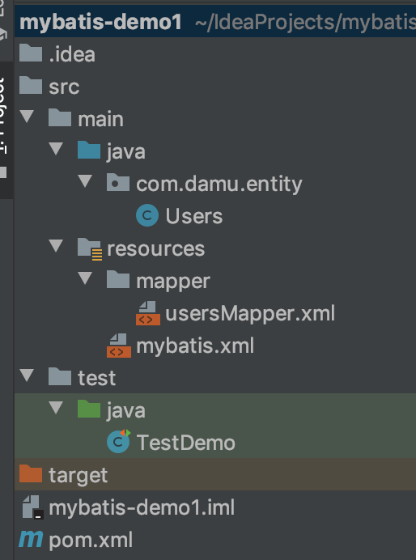
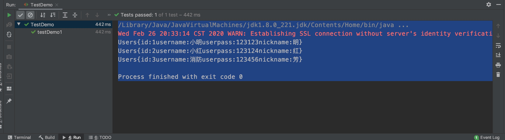

### 一、使用Maven构建项目

```shell
mvn archetype:generate -DgroupId=com.mycompany.app  -DartifactId=mybatis-demo1 -DarchetypeArtifactId=maven-archetype-quickstart -DinteractiveMode=false
```


### 二、编写项目



Users.java

```java
package com.damu.entity;

import lombok.Data;

/**
 * Created by Guaguaerhao on 2020/2/26 10:06
 */

@Data
public class Users {
    public Integer id;

    public String username;

    public String userpass;

    public String nickname;

    @Override
    public String toString(){
        return "Users{" +
                "id:" + id +
                "username:" + username +
                "userpass:" + userpass +
                "nickname:" + nickname +
                "}";
    }
}

```

userMapper.xml

```xml
<?xml version="1.0" encoding="UTF-8" ?>
<!DOCTYPE mapper
        PUBLIC "-//mybatis.org//DTD Mapper 3.0//EN"
        "http://mybatis.org/dtd/mybatis-3-mapper.dtd">
<mapper namespace="com.damu.entity.Users">
    <select id="usersList" resultType="com.damu.entity.Users">
        select * from users
    </select>
</mapper>
```

mybatis.xml：用于连接mysql，配置引入对应数据表的mapper

```xml
<?xml version="1.0" encoding="UTF-8" ?>
<!DOCTYPE configuration
        PUBLIC "-//mybatis.org//DTD Config 3.0//EN"
        "http://mybatis.org/dtd/mybatis-3-config.dtd">
<configuration>
    <environments default="development">
        <environment id="development">
            <transactionManager type="JDBC"/>
            <dataSource type="POOLED">
                <property name="driver" value="com.mysql.jdbc.Driver"/>
                <property name="url" value="jdbc:mysql://192.168.31.58:3306/mybatis-demo1"/>
                <property name="username" value="root"/>
                <property name="password" value="123456"/>
            </dataSource>
        </environment>
    </environments>
    <mappers>
<!--        <mapper resource="com/mybatis/example/BlogMapper.xml"/>-->
        <mapper resource="mapper/usersMapper.xml"/>
    </mappers>
</configuration>
```

TestDemo.java

```java
import com.damu.entity.Users;
import org.apache.ibatis.io.Resources;
import org.apache.ibatis.session.SqlSession;
import org.apache.ibatis.session.SqlSessionFactory;
import org.apache.ibatis.session.SqlSessionFactoryBuilder;
import org.junit.Test;

import javax.annotation.Resource;
import java.io.IOException;
import java.io.InputStream;
import java.util.List;

/**
 * Created by Guaguaerhao on 2020/2/26 20:19
 */
public class TestDemo {
    /**
     * 通过JUnit测试
     */
    @Test
    public void testDemo1() throws IOException {
        String resource = "mybatis.xml";
        InputStream is = Resources.getResourceAsStream(resource);
        SqlSessionFactory factory =
                new SqlSessionFactoryBuilder().build(is);

        // 打开和数据库之间的会话
        SqlSession session = factory.openSession();

        List<Users> list = session.selectList("usersList");

        for (Users user: list){
            System.out.println(user);
        }

        session.close();
    }
}

```

Pom.xml

```xml
<?xml version="1.0" encoding="UTF-8"?>
<project xmlns="http://maven.apache.org/POM/4.0.0"
         xmlns:xsi="http://www.w3.org/2001/XMLSchema-instance"
         xsi:schemaLocation="http://maven.apache.org/POM/4.0.0 http://maven.apache.org/xsd/maven-4.0.0.xsd">
    <modelVersion>4.0.0</modelVersion>

    <groupId>com.imooc.mybatis</groupId>
    <artifactId>mybatis-demo1</artifactId>
    <version>1.0-SNAPSHOT</version>

    <dependencies>
        <dependency>
            <groupId>org.mybatis</groupId>
            <artifactId>mybatis</artifactId>
            <version>3.4.3</version>
        </dependency>

        <dependency>
            <groupId>mysql</groupId>
            <artifactId>mysql-connector-java</artifactId>
            <version>5.1.41</version>
        </dependency>

        <!-- https://mvnrepository.com/artifact/org.projectlombok/lombok -->
        <dependency>
            <groupId>org.projectlombok</groupId>
            <artifactId>lombok</artifactId>
            <version>1.18.12</version>
            <scope>provided</scope>
        </dependency>

        <!-- https://mvnrepository.com/artifact/junit/junit -->
        <dependency>
            <groupId>junit</groupId>
            <artifactId>junit</artifactId>
            <version>4.13</version>
            <scope>test</scope>
        </dependency>

    </dependencies>
</project>
```

### 三、创建数据库

```mysql
创建mybatis-demo1数据库
CREATE DATABASE `mybatis-demo1` CHARACTER SET utf8mn4;

创建数据表users
CREATE TABLE users(
	id int not null primary key auto_increment,
  username varchar(32) not null,
  userpass varchar(32) not null,
	nickname varchar(32) not null
);
```


### 四、以上三步都准备好了就可以执行 测试类 TestDemo中的testDemo1方法

打印的结果如下：




通过以上的操作大致熟悉了mybatis的作用。这只是一个小小的开始。


